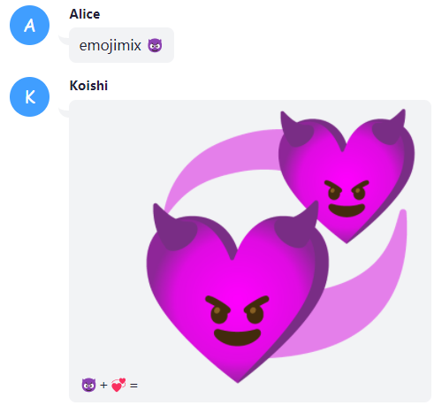
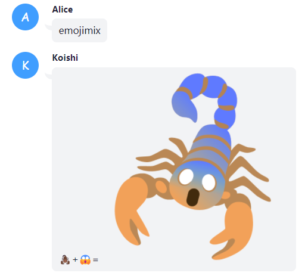

# koishi-plugin-emojimix

Koishi emojimix插件。提供0~2个emoji，生成对应的emojimix。

## 使用说明

`emojimix [emoji1] [emoji2]`

emoji1 和 emoji2 均为可选参数。
将会生成两个emoji的混合图片，未提供的emoji将会随机选取。

注意并非所有emoji之间都存在相应的混合图片。

## 效果图

